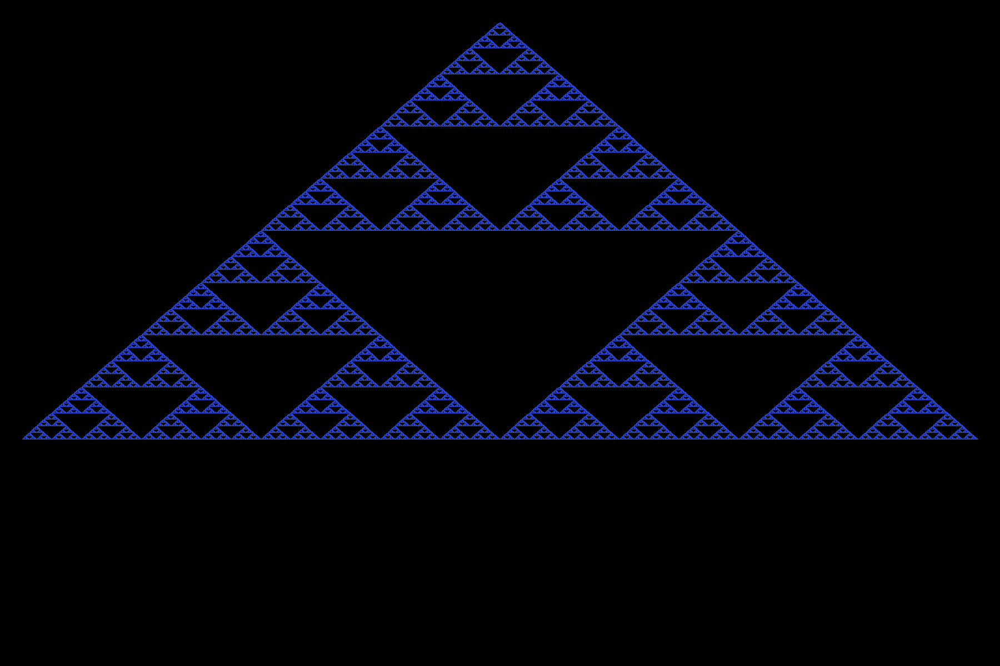

# Odd Product Identity — Pascal & Sierpiński Tree

<p align="center">
  
</p>

This project explores **mathematical identities involving sums of consecutive odd integers** and their relationship to integer products.  
It extends those ideas into **Pascal’s triangle**, **random-walk lattices**, and **Sierpiński-style modular fractals**.

---

## 🧮 Core Identity

For positive integers \(p\) and \(q\), the product \(pq\) can be expressed as the sum of \(p\) consecutive odd numbers centered around \(q\):

\[
pq = \sum_{k = -\frac{p-1}{2}}^{\frac{p-1}{2}} \bigl(2q + 2k - 1\bigr)
\]

This connects multiplication to the geometry of symmetric sequences of odd integers — the **Odd Product Identity**.

---

## 🌳 Symmetric Odd Number Tree Visualization

Interactive trees show how odd numbers arrange symmetrically around a center value, expanding by ±2 each row.

### Pattern Properties
- **Row n:** contains (1 + 2n) odd numbers symmetric around the center  
- **Values:** start at (center − 2n) and increment by 2  
- **Sum:** always = center × (number of terms in row)  
- **Growth:** each row adds one value on each side

### Example – Center = 3
```

3  = 3
9  = 1 + 3 + 5
15 = -1 + 1 + 3 + 5 + 7
21 = -3 + -1 + 1 + 3 + 5 + 7 + 9
27 = -5 + -3 + -1 + 1 + 3 + 5 + 7 + 9 + 11

```

### Example – Center = 15
```

15  = 15
45  = 13 + 15 + 17
75  = 11 + 13 + 15 + 17 + 19
105 = 9 + 11 + 13 + 15 + 17 + 19 + 21
135 = 7 + 9 + 11 + 13 + 15 + 17 + 19 + 21 + 23

````

### Mathematical Insight
The sum of *n* consecutive odd numbers centered around *k* is always *k × n*, linking directly to the odd-product identity.

---

## 🧭 Interactive Visualizations

- [Center = 3 — Original Tree](https://omaregeh.github.io/odd-product-identity/symmetric-odd-tree-center3.html)  
- [Center = 15 — Larger Tree](https://omaregeh.github.io/odd-product-identity/symmetric-odd-tree-center15.html)  
- [Center = 3 — Pascal + Sierpiński Tree](https://omaregeh.github.io/odd-product-identity/symmetric-odd-tree-center3-pascal.html)

Each page lets you vary depth, scale by multiplicity, and toggle modular colorings.

---

## 🔷 Pascal & Sierpiński Extension

The **Pascal + Sierpiński** page overlays binomial coefficients on the symmetric odd tree.

At depth *n*:
\[
x = 3 + 2k,\qquad M(n,k)=C\!\left(n,\frac{n+k}{2}\right)
\]
(defined only when *n + k* is even)

### Identities
\[
\sum_k (3+2k)\,C\!\left(n,\frac{n+k}{2}\right)=3·2^n
\]
\[
\sum_k (3+2k)^2\,C\!\left(n,\frac{n+k}{2}\right)=(9+4n)·2^n
\]

Mean = 3 Variance = 4n → discrete diffusion process.

### Modular / Fractal Patterns
- **p = 2:** classic Sierpiński triangle (odd/even binomial pattern)  
- **p = 3, 5, 7:** higher-order Lucas-theorem fractals  
- **Large n:** multiplicities approximate a Gaussian curve

---

## 🧩 Files Included

| File | Purpose |
|------|----------|
| `odd_product_identity.py` | Compute decompositions for a single N |
| `plot_multiple_N.py` | Plot decompositions for many N |
| `generate_tree.py` | Generate the symmetric odd-number tree |
| `symmetric-odd-tree-center3.html` | Interactive tree (center = 3) |
| `symmetric-odd-tree-center15.html` | Interactive tree (center = 15) |
| `symmetric-odd-tree-center3-pascal.html` | Pascal + Sierpiński extension |
| `main.tex` | LaTeX draft with definitions & theorems |

---

## ⚙️ How to Use

Install matplotlib:
```bash
pip install matplotlib
````

Run the Python scripts:

```bash
python3 odd_product_identity.py
python3 plot_multiple_N.py
python3 generate_tree.py
```

Then open the HTML files in your browser or via GitHub Pages.

---

## 🧠 Research Connections

| Theme                    | What to Try                     | Why It’s Interesting                      |
| ------------------------ | ------------------------------- | ----------------------------------------- |
| **Mod-p fractals**       | Color by p = 2, 3, 5, 7         | Reveals Sierpiński-like self-similarities |
| **Boundary conditions**  | Keep k ≥ 0 or x ≥ 0             | Connects to Catalan and Ballot numbers    |
| **Generating functions** | ( \sum C(n,(n+k)/2)x^k )        | Links to Chebyshev & Hermite polynomials  |
| **Prime structure**      | Highlight where 3 + 2k is prime | Tests prime density in odd lattices       |
| **3-D surface**          | Height = multiplicity           | Builds a “Pascal mountain” view           |

---

## 🖼️ Image Credits

The image above was generated from the **p = 2 (Sierpiński)** mask at depth 9, colored blue on a black background.

---

## 📜 Reference

Based on *Symmetric Odd Number Tree (Center 3) + Pascal Multiplicities*
© 2025 Omar Egeh — Odd Product Identity Repository

