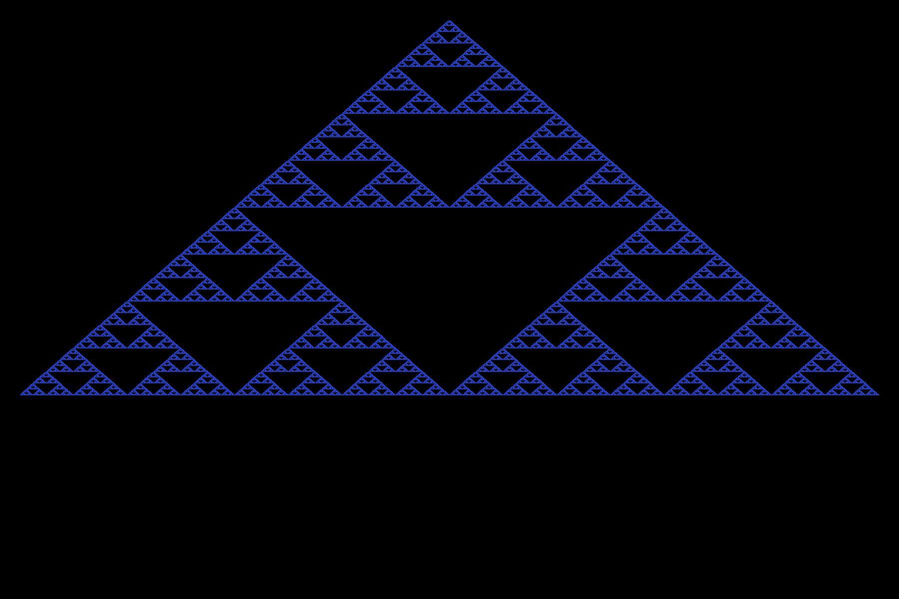

# Odd Product Identity

This project explores a simple but interesting way of looking at multiplication.

Normally, multiplication is introduced as repeated addition:

```text
3 × 3 = 3 + 3 + 3
```

But the same product can also be written as a balanced sum of odd numbers:

```text
3 × 3 = 1 + 3 + 5
```

Both equal 9.

The idea is that instead of adding the same number repeatedly, we can build a row of odd numbers around a center value. The row stays balanced because the numbers on the left and right cancel out around the middle.

For example:

```text
3 = 3 = 3 × 1

9 = 1 + 3 + 5 = 3 × 3

15 = -1 + 1 + 3 + 5 + 7 = 3 × 5

21 = -3 + -1 + 1 + 3 + 5 + 7 + 9 = 3 × 7
```

So the center number acts like the average of the row.

## Main idea

A centered row of consecutive odd numbers has a sum equal to:

```text
center number × number of terms
```

That means multiplication can be shown as a balanced addition pattern, not only as repeated addition.

## Why this is interesting

This gives a visual way to compare two forms of multiplication:

```text
3 × 3 = 3 + 3 + 3
```

and

```text
3 × 3 = 1 + 3 + 5
```

The first version repeats the same value.

The second version spreads outward from the center while keeping the same average.

## Interactive Visualizations

- [Odd Addition Multiplication Tree](https://omaregeh.github.io/odd-product-identity/symmetric-odd-tree-center3.html)
- [Center = 15 — Larger Tree](https://omaregeh.github.io/odd-product-identity/symmetric-odd-tree-center15.html)

## Files

- `symmetric-odd-tree-center3.html` — main interactive odd-number tree
- `symmetric-odd-tree-center15.html` — older larger center example
- `generate_tree.py` — Python generation file
- `odd_product_identity.py` — Python identity exploration
- `plot_multiple_N.py` — plotting file
- `main.tex` — LaTeX write-up

## Preview


